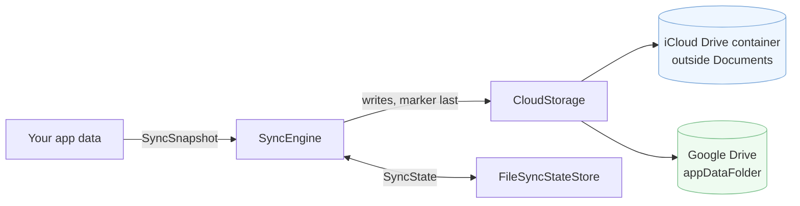

# BackupKit


Kotlin Multiplatform backup into the user's **own** cloud: iCloud Drive on iOS, the Google Drive
app-data folder on Android. No server, no account on your side, no OAuth client setup on iOS.


[](https://central.sonatype.com/artifact/com.vocabloot/backupkit)
[](https://github.com/vaazh-studios/backupkit/actions/workflows/ci.yml)
[](https://kotlinlang.org)
[](LICENSE)
[](https://vaazh-studios.github.io/backupkit/)

## Features

- **The user's cloud, not yours.** Files land in the app's private iCloud container or Drive's hidden `appDataFolder` (the one WhatsApp uses). Nothing to host, no accounts to run.
- **Zero code on iOS, one tap on Android.** The iCloud entitlement is the whole iOS setup, for CloudKit or iCloud Drive; on Android the user sees Google's permission dialog once, then tokens are silent.
- **Complete-or-absent sync.** `SyncEngine` diffs, orders uploads so a marker file lands last, saves state after every step, resumes after a kill, and detects an account switch instead of merging two accounts.
- **Restore that survives a kill.** A typed probe for the offer, a write hold so sync never clobbers a half-restored device, and a resumable download with a commit boundary, per-file attempts and source revalidation.
- **Typed errors.** Every failure is one of seven `CloudError` values; nothing platform-specific leaks out.
- **Small.** About 1,200 lines. Coroutines, kotlinx-serialization and kotlinx-io in common code; Ktor and Play Services Identity on Android only; iOS links no HTTP client. No DI framework, no Compose, no Firebase.

## Support matrix

| | CloudKit (iOS) | iCloud Drive (iOS) | Google Drive app-data (Android) |
|---|---|---|---|
| Transport `CloudStorage` | ✅ `CloudKitStorage` | ✅ `ICloudStorage` | ✅ `GoogleDriveStorage` |
| Sync `SyncEngine` | ✅ | ✅ | ✅ |
| Auth | entitlement only | entitlement only | silent token, `DriveConsent` for the one-time dialog |
| Nested paths | ✅ (record name encodes `/`) | ✅ | flat folder, path used as file name |
| File ids | – | – | `RemoteFile.remoteId` |
| Sizes in `list()` | always known | -1 until downloaded | always known |
| Reads | network fetch, batched by `prefetch` | placeholder download, one at a time | network fetch |
| Single upload cap | 1 asset per save, container quota | container quota | 5 MB (multipart) |
| Verified on a real device | Vocabloot development build, iPhone 16 Pro, 2026-09-07 | Vocabloot development build, iPhone 16 Pro, 2026-09-05 | Vocabloot development build, Pixel 7 Pro, 2026-09-02 and 2026-09-07 |

Which iOS transport? **CloudKit** for app data the user never opens as files: saves complete when Apple's server has the record, reads are definite, no placeholder files. **iCloud Drive** when the files should also be visible in the Files app or another app reads the same container. Both are the user's own iCloud storage.

Targets: `android`, `iosArm64`, `iosSimulatorArm64`, `iosX64`. Kotlin 2.3.20, minSdk 24, iOS 16+.

## Who's using it

- [Vocabloot](https://vocabloot.com) ([App Store](https://apps.apple.com/app/id6792888619), [Google Play](https://play.google.com/store/apps/details?id=com.tntstudios.snaplingo)): a photo-to-vocabulary app whose wordbook, photos and doodles mirror through this exact code. BackupKit is that code, extracted. As of 2026-09-07 it runs in Vocabloot's development builds on both platforms; the next Vocabloot release is the first store build that carries it.

Using BackupKit? Open a PR and add yourself.

## Install

```kotlin
commonMain.dependencies {
    implementation("com.vocabloot:backupkit:0.1.0")
}
```

Then do the platform setup once: [iOS](docs/setup-ios.md) (an entitlement), [Android](docs/setup-android.md) (a Google Cloud OAuth client).

## Try it before the first release

`0.1.0` is being published to Maven Central. Until it resolves, either of these works:

**Local Maven.** Clone, publish to `~/.m2`, and add `mavenLocal()` to your repositories:

```bash
git clone https://github.com/vaazh-studios/backupkit.git
cd backupkit && ./gradlew :backupkit:publishToMavenLocal
```

**Composite build.** Point your `settings.gradle.kts` at the checkout and depend on it as if it were published:

```kotlin
includeBuild("../backupkit")
```

**Run the sample.** A Compose Multiplatform notes app that adds, deletes, syncs, and offers a restore:

```bash
./gradlew :sample:androidApp:installDebug          # Android device or emulator
brew install xcodegen && cd sample/iosApp && xcodegen generate && open iosApp.xcodeproj   # iOS: set your team, run on a device signed into iCloud
```

The sample needs its own iCloud container (`iCloud.com.vocabloot.backupkit.sample`) and, on Android, an OAuth client for its package and your signing SHA-1; the setup guides walk through both. Source: [`sample/shared`](sample/shared/src/commonMain/kotlin/com/vocabloot/backupkit/sample), [`sample/androidApp`](sample/androidApp), [`sample/iosApp`](sample/iosApp).

## Quickstart

```kotlin
val storage: CloudStorage = platformCloudStorage()      // CloudKitStorage(...) or ICloudStorage() on iOS, GoogleDriveStorage(context) on Android

val engine = SyncEngine(
    storage = storage,
    stateStore = FileSyncStateStore("$appFilesDir/backupkit-state.json"),
    policy = SyncPolicy(markerPath = "backup.json"),
)

val notes = notesJson()          // ByteArray
val header = headerJson()        // ByteArray, uploaded last: its presence means "complete"
val outcome = engine.sync(
    SyncSnapshot(
        listOf(
            SyncEntry("notes.json", SyncSource.Bytes(notes), notes.size.toLong(), hash = sha256Hex(notes)),
            SyncEntry("backup.json", SyncSource.Bytes(header), header.size.toLong(), hash = sha256Hex(header)),
        ),
    ),
)
when (outcome) {
    is SyncOutcome.Synced -> showUpToDate()
    is SyncOutcome.Unavailable -> showWhy(outcome.reason)   // NoAccount, NeedsConsent, RestorePending
    is SyncOutcome.Failed -> showStuck(outcome.error)       // Offline, StorageFull, AuthRevoked, Transport, ...
}
```

Large write-once files (photos) go in as `SyncSource.LocalFile(path)` with `hash = null`: they are
compared by size, uploaded before the hashed entries, and never re-uploaded. Pass
`SyncSnapshot(entries, isEmpty = notes.isEmpty())` so a fresh install with no data never overwrites
an existing backup (the engine answers `RestorePending` instead).

## How it works



No server and no account of yours in the picture: the files sit in the user's own cloud, invisible to them in Files and Drive, readable only by your app. `SyncEngine` diffs the snapshot against the remote listing, uploads size-compared files, then hashed ones, then the marker, and saves state after every step so a killed process resumes where it stopped.

## Two layers

| | Type | Use it when |
|---|---|---|
| Layer 1 | `CloudStorage` | You want files in the user's cloud and your own logic on top: `writeFile`, `writeBytes`, `readBytes`, `downloadFile`, `delete`, `list`, `exists`, `availability`. |
| Layer 2 | `SyncEngine` | You want "mirror this set of files, safely": diffing, ordering, resume after a kill, account-switch detection, a restore offer. See [the contract](docs/contract.md). |

Both implementations behave identically, with two documented differences: Drive has file ids
(`RemoteFile.remoteId`) and a 5 MB single-upload cap; iCloud reports not-yet-downloaded files with
`size == -1`.

## Restore on first launch

```kotlin
when (val probe = engine.probe()) {
    is RemoteProbe.Found -> offerRestore(parseHeader(probe.marker), probe.source)   // your schema, your UI
    RemoteProbe.NotReady -> showStillUploading()                                    // a writer never finished, or iCloud is still fetching
    RemoteProbe.None, is RemoteProbe.Unavailable, is RemoteProbe.Failed -> Unit
}
```

Then hand `RestoreEngine` a plan pinned to that source. Required files are the commit boundary: all of
them download before any optional file, and one failure fails the run. Optional files are best-effort
with three attempts each. Give files an opaque `group` (a record id, a word) and a `RestorePlacement`:
the engine hands each group to you once its files are local, you import them into your own model and
answer `Placed` or `Rejected`, and progress comes back in files and in groups. Progress is written to
a record after every file, so a killed process continues from where it stopped with `resume()`, which
first re-checks that the remote set is still the one the user accepted and reports `SourceChanged`
otherwise.

```kotlin
engine.setHold(WriteHold.RestoreRunning)                       // sync() writes nothing while a hold is set
val restore = RestoreEngine(engine, storage, FileRestoreRecordStore(path), placement = { group, files ->
    if (group == "meta") importManifest(files) else attachPhotos(group, files)   // your model, your rules
    PlacementResult.Placed
})
val outcome = restore.start(
    RestorePlan(source = probe.source, files = listOf(
        RestoreFile("manifest.json", toLocalPath = "$dir/manifest.json", required = true, group = "meta"),
        RestoreFile("photos/w1.jpg", toLocalPath = "$dir/w1.jpg", required = false, group = "w1"),
        RestoreFile("photos/w1.png", toLocalPath = "$dir/w1.png", required = false, group = "w1"),
    )),
) { progress -> show("Photos for ${'$'}{progress.groupsDone} of ${'$'}{progress.groupsTotal} words") }
if (outcome !is RestoreOutcome.Failed) engine.setHold(WriteHold.None)
```

Importing the files into your own data structures is your code; BackupKit never guesses your schema.

## Android consent, once

```kotlin
val consent = DriveConsent(context)
val launcher = rememberLauncherForActivityResult(StartIntentSenderForResult()) { result ->
    granted = consent.wasGranted(result.data)
}
scope.launch {
    when (val r = consent.request()) {
        is DriveConsent.Request.Needed -> launcher.launch(IntentSenderRequest.Builder(r.intentSender).build())
        DriveConsent.Request.AlreadyGranted -> granted = true
        is DriveConsent.Request.Failed -> showError(r.cause)
    }
}
```

Already running Google Sign-In? Pass your own `DriveTokenProvider` to `GoogleDriveStorage`.

## Scheduling

BackupKit does one sync per call and nothing in the background. A debounce plus a foreground
trigger is twelve lines: [docs/scheduling.md](docs/scheduling.md).

## Errors

Every failure is a `CloudStorageException` carrying one `CloudError`:
`NotAvailable`, `NeedsConsent`, `Offline`, `StorageFull`, `AuthRevoked`, `NotFound`, `Transport`.
`SyncEngine.sync` never throws for cloud failures; it returns `SyncOutcome.Failed(error)`.

## Limits and honesty

- Drive: multipart uploads are capped at 5 MB per file. Resumable uploads are on the roadmap.
- Drive app-data counts against the user's Drive quota (Android Auto Backup does not).
- iCloud on the simulator needs an iCloud login on the simulator.
- Verified on real devices, in Vocabloot's development builds: `GoogleDriveStorage` (Pixel 7 Pro,
  2026-09-02 and 2026-09-07), `ICloudStorage` (iPhone 16 Pro, 2026-09-05), `CloudKitStorage`
  (iPhone 16 Pro, 2026-09-07). `SyncEngine` ran every one of those passes. No store build carries
  BackupKit yet.
- `RestoreEngine` is covered by unit tests, and Vocabloot's development build restores its photos
  through it as of 2026-09-07 (its own coordinator still owns onboarding routing and the metadata
  commit). That build has not done a device restore yet, so the class stays `@ExperimentalRestoreApi`
  until it has. Nothing Vocabloot-specific lives in it: files carry an opaque group and the app
  supplies a `RestorePlacement`.
- The sample app exercises `ICloudStorage` and `GoogleDriveStorage`. It has a `USE_CLOUDKIT`
  switch but has not run CloudKit on a device; its entitlements list iCloud Documents only.
- Not included: scheduling, encryption, restore-into-your-model, any UI, Dropbox/OneDrive
  (see [CloudBridge](https://github.com/jacobras/CloudBridge) for those).

## Related work

[react-native-cloud-storage](https://github.com/kuatsu/react-native-cloud-storage) inspired the
Layer 1 verbs. [IceCream](https://github.com/caiyue1993/IceCream) and Apple's `CKSyncEngine`
inspired Layer 2's "engine owns the state" shape.

## Documentation

- [iOS setup](docs/setup-ios.md), [Android setup](docs/setup-android.md)
- [The SyncEngine contract](docs/contract.md): the ten guarantees and the error mapping
- [Bring your own scheduler](docs/scheduling.md)
- [Design](docs/design.md), [Publishing](docs/publishing.md) (maintainers)
- [API reference](https://vaazh-studios.github.io/backupkit/) (Dokka); the ABI is tracked in [`backupkit/api`](backupkit/api).

## Dependencies

Common: `kotlinx-coroutines-core` (exposed), `kotlinx-serialization-json`, `kotlinx-io-core`. Android only: `ktor-client-core` (exposed, pass your own `HttpClient` if you have one) with the OkHttp engine, and `play-services-auth`. iOS links no HTTP client at all. Nothing else.

## License

Apache 2.0. Made by [Vaazh Studios](https://github.com/vaazh-studios).
