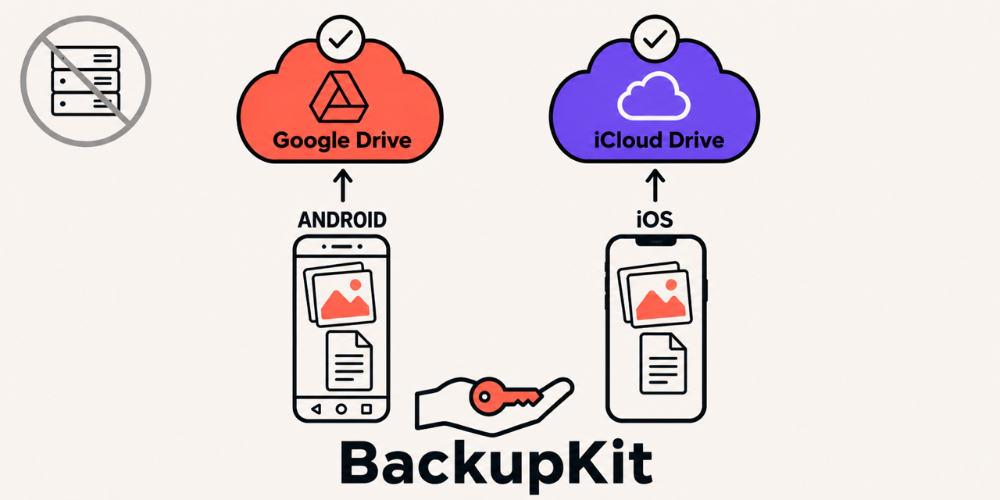

# BackupKit



Kotlin Multiplatform backup into the user's **own** cloud: iCloud on iOS (CloudKit or iCloud Drive), the Google Drive app-data folder on Android. No server, no account on your side, no OAuth client setup on iOS.


[](https://central.sonatype.com/artifact/com.vocabloot/backupkit)
[](https://github.com/vaazh-studios/backupkit/actions/workflows/ci.yml)
[](https://kotlinlang.org)
[](LICENSE)
[](https://vaazh-studios.github.io/backupkit/)
[](https://github.com/vaazh-studios/backupkit/discussions)

- [Why](#why) · [Features](#features) · [BackupKit 101](#backupkit-101) · [A more advanced example](#a-more-advanced-example)
- [Support matrix](#support-matrix) · [Requirements](#requirements) · [Samples](#samples) · [Testing](#testing)
- [Who's using it](#whos-using-it) · [Communication](#communication) · [Limits and honesty](#limits-and-honesty) · [Compared with](#compared-with)

## Why

Every app with a wordbook or a journal eventually needs "a new phone should not lose my stuff". A backend for that means accounts, hosting and a privacy policy that says you hold user data. The user already pays for a cloud. BackupKit puts the files there, invisible to them, readable only by your app, with an engine that keeps the mirror correct across kills, retries and account switches.

## Features

- **The user's cloud, not yours.** App-private iCloud container or Drive's hidden `appDataFolder` (the one WhatsApp uses).
- **Zero code on iOS, one tap on Android.** The iCloud entitlement is the iOS setup; Android shows Google's dialog once.
- **Complete-or-absent sync.** Diffs, uploads the marker last, saves state after every step, resumes after a kill, refuses to merge two accounts, and refuses to delete most of a healthy backup without the user's say-so.
- **Restore that survives a kill.** Typed probe, write hold, resumable download with a commit boundary and per-file attempts.
- **Typed errors.** Seven `CloudError` values, nothing platform-specific leaks out.
- **Small.** About 1,200 lines. No DI framework, no Compose, no Firebase; iOS links no HTTP client.

## BackupKit 101

```kotlin
// libs.versions.toml            backupkit = { module = "com.vocabloot:backupkit", version = "0.3.0" }
// build.gradle.kts (shared)     commonMain.dependencies { implementation(libs.backupkit) }
```

One entitlement on iOS, one OAuth client on Android ([setup](https://vaazh-studios.github.io/backupkit/setup-ios/)), then:

```kotlin
// iOS (iosMain)                                  // Android (androidMain)
val storage: CloudStorage = CloudKitStorage(       val storage: CloudStorage = GoogleDriveStorage(context)
    checkpointPath = "$dir/ck-checkpoint.json",
    cacheDirectory = "$dir/ck-cache",
)                                                  // or ICloudStorage() for files the user may open in Files

// common
val engine = SyncEngine(
    storage = storage,
    stateStore = FileSyncStateStore("$dir/backupkit-state.json"),
    policy = SyncPolicy(markerPath = "backup.json"),
)
val notes: ByteArray = notesJson()
val header: ByteArray = headerJson()               // uploaded last: its presence means "complete"
val outcome = engine.sync(
    SyncSnapshot(
        listOf(
            SyncEntry("notes.json", SyncSource.Bytes(notes), notes.size.toLong(), hash = sha256Hex(notes)),
            SyncEntry("backup.json", SyncSource.Bytes(header), header.size.toLong(), hash = sha256Hex(header)),
        ),
        isEmpty = notes.isEmpty(),                 // a fresh install never overwrites a real backup
    ),
)
when (outcome) {
    is SyncOutcome.Synced -> showUpToDate()
    is SyncOutcome.Unavailable -> showWhy(outcome.reason)   // NoAccount, NeedsConsent, RestorePending
    is SyncOutcome.Failed -> showStuck(outcome.error)       // Offline, StorageFull, AuthRevoked, Transport, ...
}
```

Photos and other write-once files go in as `SyncSource.LocalFile(path)` with `hash = null`: compared by size, uploaded first, never re-uploaded.

## A more advanced example

Offer a restore on first launch, then pull the files down with a commit boundary and resume after a kill:

```kotlin
when (val probe = engine.probe()) {
    is RemoteProbe.Found -> if (askUser(parseHeader(probe.marker))) restore(probe)
    RemoteProbe.NotReady -> showStillUploading()
    else -> Unit
}

suspend fun restore(found: RemoteProbe.Found) {
    engine.setHold(WriteHold.RestoreRunning)
    val restore = RestoreEngine(engine, storage, FileRestoreRecordStore("$dir/restore.json"), placement = { group, files ->
        importIntoMyModel(group, files); PlacementResult.Placed      // your schema, your rules
    })
    val outcome = restore.start(RestorePlan(found.source, files = listOf(
        RestoreFile("notes.json", toLocalPath = "$dir/notes.json", required = true, group = "meta"),
    ))) { p -> show("${'$'}{p.groupsDone} of ${'$'}{p.groupsTotal}") }
    if (outcome !is RestoreOutcome.Failed) engine.setHold(WriteHold.None)
}
```

Full walkthrough, holds and `resume()`: [Restore on first launch](https://vaazh-studios.github.io/backupkit/restore/).

## Support matrix

| | CloudKit (iOS) | iCloud Drive (iOS) | Google Drive app-data (Android) |
|---|---|---|---|
| Transport | `CloudKitStorage` | `ICloudStorage` | `GoogleDriveStorage` |
| Auth | entitlement only | entitlement only | silent token, `DriveConsent` once |
| Single upload cap | 1 asset per save | container quota | none (resumable above 5 MB) |
| Verified on a real device | iPhone 16 Pro, 2026-09-07 | iPhone 16 Pro, 2026-09-05 | Pixel 7 Pro, 2026-09-07 |

CloudKit for app data the user never opens as files; iCloud Drive when the files should show in the Files app. Every row, and the differences between the transports: [support matrix](https://vaazh-studios.github.io/backupkit/support-matrix/).

## Requirements

| | Minimum | Built with |
|---|---|---|
| Kotlin / Gradle / AGP | 2.3 / 9.0 / 9.0 | 2.3.20 / 9.4.1 / 9.2.1 |
| Android | minSdk 24 | compileSdk 36 |
| iOS / Xcode | 16 / 16 | iOS 26 / Xcode 26 |

Targets: `android`, `iosArm64`, `iosSimulatorArm64`, `iosX64`. Versioning and the experimental API policy: [stability](https://vaazh-studios.github.io/backupkit/stability/).

## Samples

| Sample | Shows | Recording |
|---|---|---|
| [Notes](sample/README.md) | sync with a marker, restore dialog on first launch, Android consent | pending |

## Testing

`com.vocabloot:backupkit-test` (same version) ships the fakes the library's own tests run on, so your sync and restore code is unit-testable with no cloud:

```kotlin
val storage = FakeCloudStorage(readLocal = files::read, writeLocal = files::write)
val engine = SyncEngine(storage, MemorySyncStateStore(), SyncPolicy(markerPath = "backup.json"))
storage.failPutsContaining = "photos/"              // then assert the outcome and storage.putLog
```

## Who's using it

- [Vocabloot](https://vocabloot.com) ([App Store](https://apps.apple.com/app/id6792888619), [Google Play](https://play.google.com/store/apps/details?id=com.tntstudios.snaplingo)): wordbook, photos and doodles mirror through this exact code. BackupKit is that code, extracted; Vocabloot 1.2 is the first store build that carries it.

Works with anything that gives you bytes or a file path: SQLDelight, Room, Okio, kotlinx-serialization, your own Ktor client on Android. Using BackupKit? Open a PR and add yourself.

## Communication

- Questions and ideas: [Discussions](https://github.com/vaazh-studios/backupkit/discussions).
- Bugs: [Issues](https://github.com/vaazh-studios/backupkit/issues/new/choose), with the `CloudError` and platform.
- Security: [SECURITY.md](SECURITY.md), privately.
- Contributing: [CONTRIBUTING.md](CONTRIBUTING.md). Conduct: [CODE_OF_CONDUCT.md](CODE_OF_CONDUCT.md).

## Limits and honesty

- Drive: files above 5 MB use Drive's resumable protocol in 8 MiB chunks, streamed from disk; the multipart path stays for small files. Verified with mocked Drive responses only so far, not against Drive on a device.
- Drive app-data counts against the user's Drive quota (Android Auto Backup does not).
- iCloud on the simulator needs an iCloud login on the simulator.
- Verified on real devices, in Vocabloot's development builds: `GoogleDriveStorage` (Pixel 7 Pro,
  2026-09-02 and 2026-09-07), `ICloudStorage` (iPhone 16 Pro, 2026-09-05), `CloudKitStorage`
  (iPhone 16 Pro, 2026-09-07). `SyncEngine` ran every one of those passes. No store build carries
  BackupKit yet.
- `RestoreEngine` is covered by unit tests, and Vocabloot's development build restores its photos
  through it as of 2026-09-07 (its own coordinator still owns onboarding routing and the metadata
  commit). That build has not done a device restore yet, so the class stays `@ExperimentalRestoreApi`
  until it has. Nothing Vocabloot-specific lives in it: files carry an opaque group and the app
  supplies a `RestorePlacement`.
- The sample app exercises `ICloudStorage` and `GoogleDriveStorage`. It has a `USE_CLOUDKIT`
  switch but has not run CloudKit on a device; its entitlements list iCloud Documents only.
- Not included: scheduling, encryption, restore-into-your-model, any UI, Dropbox/OneDrive
  (see [CloudBridge](https://github.com/jacobras/CloudBridge) for those).

Open items with workarounds: [known issues](https://vaazh-studios.github.io/backupkit/known-issues/).

## Compared with

| | Android Auto Backup | Own server | CloudBridge | react-native-cloud-storage | BackupKit |
|---|---|---|---|---|---|
| Where the data lives | Google's backup service | your servers | user's Dropbox, Drive, OneDrive, WebDAV | user's iCloud or Drive | user's iCloud or Drive |
| iOS | no | yes | yes | yes | **yes, entitlement only** |
| Accounts you run | none | yes | none | none | **none** |
| Sync engine (diff, resume, marker, holds) | opaque | yours | no, file API only | no, file API only | **yes** |
| Restore with commit boundary | opaque | yours | no | no | **yes** |
| Kotlin Multiplatform | n/a | n/a | yes | no (React Native) | **yes** |

## Documentation

[Docs site](https://vaazh-studios.github.io/backupkit/): setup, the SyncEngine contract, restore, consent, errors, scheduling, recipes, FAQ, known issues, stability. [API reference](https://vaazh-studios.github.io/backupkit/api/) (Dokka). Design notes and publishing steps are in [docs/](docs/) for maintainers.

Inspired by [react-native-cloud-storage](https://github.com/kuatsu/react-native-cloud-storage) (the Layer 1 verbs) and by [IceCream](https://github.com/caiyue1993/IceCream) and Apple's `CKSyncEngine` (the engine owns the state).

## License

Apache 2.0. Made by [Vaazh Studios](https://github.com/vaazh-studios).
